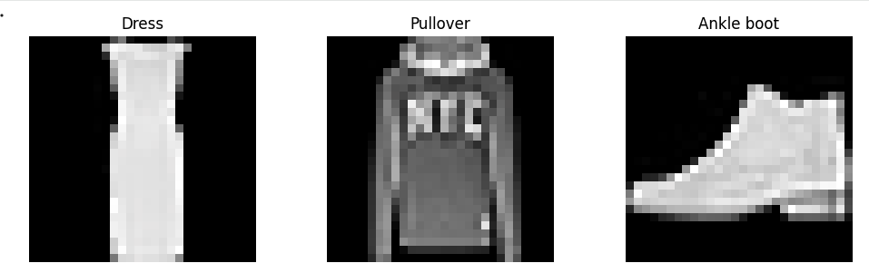

# Intro to PyTorch

## [Lecture 1 notebook](https://colab.research.google.com/drive/1y-iC5OzQZPFNMOUdW9k78gRMsbecG-F5?usp=sharing)
(local file at [Lecture-1/](Lecture-1/))

Homework: Improve the base model
- Add more hidden layers or change the number of neurons in each layer.
- Read what the sigmoid activation does, then try alternatives such as ReLU, GELU, Tanh, or others from the PyTorch activation layers: https://docs.pytorch.org/docs/main/nn.html
- Optional: read what learning-rate schedulers are and try one from PyTorch: https://docs.pytorch.org/docs/2.12/generated/torch.optim.lr_scheduler.LRScheduler.html

[Example solution](https://colab.research.google.com/drive/17Vkt3ZmunTd8wZLrw2LEJ8Ei2UnXQ7ly?usp=sharing)

## [Lecture 2 notebook](https://colab.research.google.com/drive/1nzJjbfXZl3KioOSf1oVcwzX2anSA0fdv?usp=sharing)
(local file at [Lecture-2/](Lecture-2/))

